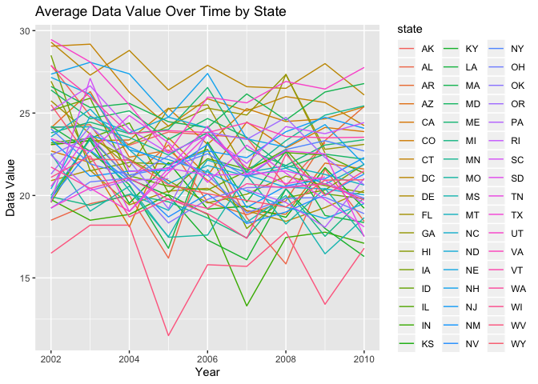

p8105\_hw3\_bw2595
================
Blair Wigsten
10/8/2019

``` r
library(tidyverse)
```

    ## ── Attaching packages ───────────────────────────────────────────────────────────────── tidyverse 1.2.1 ──

    ## ✔ ggplot2 3.2.1     ✔ purrr   0.3.2
    ## ✔ tibble  2.1.3     ✔ dplyr   0.8.3
    ## ✔ tidyr   1.0.0     ✔ stringr 1.4.0
    ## ✔ readr   1.3.1     ✔ forcats 0.4.0

    ## ── Conflicts ──────────────────────────────────────────────────────────────────── tidyverse_conflicts() ──
    ## ✖ dplyr::filter() masks stats::filter()
    ## ✖ dplyr::lag()    masks stats::lag()

``` r
library(knitr)
```

# Problem 1

``` r
library(p8105.datasets)
data("instacart")
instacart
```

    ## # A tibble: 1,384,617 x 15
    ##    order_id product_id add_to_cart_ord… reordered user_id eval_set
    ##       <int>      <int>            <int>     <int>   <int> <chr>   
    ##  1        1      49302                1         1  112108 train   
    ##  2        1      11109                2         1  112108 train   
    ##  3        1      10246                3         0  112108 train   
    ##  4        1      49683                4         0  112108 train   
    ##  5        1      43633                5         1  112108 train   
    ##  6        1      13176                6         0  112108 train   
    ##  7        1      47209                7         0  112108 train   
    ##  8        1      22035                8         1  112108 train   
    ##  9       36      39612                1         0   79431 train   
    ## 10       36      19660                2         1   79431 train   
    ## # … with 1,384,607 more rows, and 9 more variables: order_number <int>,
    ## #   order_dow <int>, order_hour_of_day <int>,
    ## #   days_since_prior_order <int>, product_name <chr>, aisle_id <int>,
    ## #   department_id <int>, aisle <chr>, department <chr>

  - There are 1384617 observations and 15 variables in the instacart
    dataset. Most variables are integer variables, with the rest
    (eval\_set, product\_name, aisle, and department) as character
    variables. Key variables for analysis could include if the item was
    reordered to determine popularity, aisle name in order to filter
    observations based on certain criteria, and order\_dow to see when
    most orders are placed during the week. An illustrative example of
    this data would be the following for the first unique id: this order
    had a total of 8 items, 3 of which were reordered items. This order
    was 9 days after the previous order (days\_since\_prior\_order) and
    placed on day 4 (Thursday). This order contained bulgarian yogurt,
    organic 4% milk fat whole milk cottage cheese, organic celery
    hearts, cucumber kirby, lightly smoked sardines in olive oil, bag of
    organic bananas, organic hass avocado, and organic whole string
    cheese. These items came from the yogurt, other creams cheeses,
    fresh vegetables, canned meat seafood, fresh fruits, and packaged
    cheese aisles. The departments the items were in were dairy eggs,
    produce, and canned goods departments. A second example of an
    interpretation of the data is as followed: order number 24 also
    contained 8 items, with 5 of those items as reorders (coded as 1),
    placed on day 6 (Saturday), and this order was placed 30 after the
    previous order for this id. The order was for grated pecorino romano
    cheese, spring water, organic half & half, super greens salad, cage
    free extra large grade AA eggs, prosciutto americano, organic garnet
    sweet potato, and asparagus. The aisles used were speciality
    cheeses, water, cream, packaged vegetables fruits, eggs, lunchmeat,
    and fresh vegetables. The departments ordered from were dairy eggs,
    beverages, produce, and
deli.

## How many aisles are there, and which aisles are the most items ordered from?

``` r
instacart %>%
  count(aisle) %>%
  arrange(desc(n))
```

    ## # A tibble: 134 x 2
    ##    aisle                              n
    ##    <chr>                          <int>
    ##  1 fresh vegetables              150609
    ##  2 fresh fruits                  150473
    ##  3 packaged vegetables fruits     78493
    ##  4 yogurt                         55240
    ##  5 packaged cheese                41699
    ##  6 water seltzer sparkling water  36617
    ##  7 milk                           32644
    ##  8 chips pretzels                 31269
    ##  9 soy lactosefree                26240
    ## 10 bread                          23635
    ## # … with 124 more rows

  - There are 134 distinct aisles. The aisles “fresh vegetables”, “fresh
    fruits”, and “packaged vegetables fruits” are where most items are
    ordered from based on the tibble produced
above.

## Make a plot that shows the number of items ordered in each aisle, limiting this to aisles with more than 10000 items ordered. Arrange aisles sensibly, and organize your plot so others can read it.

``` r
items_plot = instacart %>%
  count(aisle) %>%
  filter(n > 10000) %>%
  rename(n_items_ordered = n) %>%
  ggplot(aes(x = reorder(aisle, -n_items_ordered), y = n_items_ordered)) +
    geom_bar(stat = "identity") +
    theme(axis.text.x = element_text(angle = 90, hjust = 1, vjust = 0.5)) +
    labs(
    title = "Number of items ordered per aisle",
    x = "aisle name",
    y = "number of items ordered"
    )
items_plot
```

<!-- -->

  - This plot shows the number of items ordered in each aisle, limiting
    the plot to aisles with more than 10000 items ordered. Items have
    been arranged by most ordered to least
ordered.

## Make a table showing the three most popular items in each of the aisles “baking ingredients”, “dog food care”, and “packaged vegetables fruits”. Include the number of times each item is ordered in your table.

``` r
popular_product = instacart %>%
  group_by(product_name, aisle) %>%
  summarize(
    n_ordered = n()) %>%
  group_by(aisle) %>%
  filter(
    aisle %in% c("baking ingredients", "dog food care", "packaged vegetables fruits"), 
    min_rank(desc(n_ordered)) < 4) %>%
  arrange(n_ordered, aisle) %>%
  kable(format = "pandoc", caption = "Most popular items by aisle")
popular_product
```

| product\_name                                 | aisle                      | n\_ordered |
| :-------------------------------------------- | :------------------------- | ---------: |
| Small Dog Biscuits                            | dog food care              |         26 |
| Organix Chicken & Brown Rice Recipe           | dog food care              |         28 |
| Snack Sticks Chicken & Rice Recipe Dog Treats | dog food care              |         30 |
| Cane Sugar                                    | baking ingredients         |        336 |
| Pure Baking Soda                              | baking ingredients         |        387 |
| Light Brown Sugar                             | baking ingredients         |        499 |
| Organic Blueberries                           | packaged vegetables fruits |       4966 |
| Organic Raspberries                           | packaged vegetables fruits |       5546 |
| Organic Baby Spinach                          | packaged vegetables fruits |       9784 |

Most popular items by aisle

  - Based on the table above, snack sticks were the most ordered item
    within “dog food care” with 30 orders. Light brown sugar was the
    most ordered item in the “baking ingredients” aisle with 499 orders,
    and organic baby spinach was the most ordered item in the “packaged
    vegetables fruits” aisle with 9784
orders.

## Make a table showing the mean hour of the day at which Pink Lady Apples and Coffee Ice Cream are ordered on each day of the week; format this table for human readers (i.e. produce a 2 x 7 table).

``` r
apples_cream = instacart %>%
  rename(order_hour = order_hour_of_day) %>%
  select(product_name, order_dow, order_hour) %>%
  filter(product_name %in% c("Pink Lady Apples", "Coffee Ice Cream")) %>%
  group_by(product_name, order_dow) %>%
  summarize(
    mean_hour_of_day = mean(order_hour)) %>%
  mutate(
    day_of_week = recode(order_dow,
                         `0` = "Sunday", 
                         `1` = "Monday",
                         `2` = "Tuesday",
                         `3` = "Wednesday",
                         `4` = "Thursday",
                         `5` = "Friday",
                         `6` = "Saturday")) %>%
  select(product_name, day_of_week, mean_hour_of_day) %>%
  pivot_wider(
    names_from = "product_name",
    values_from = "mean_hour_of_day") %>%
  kable(format = "pandoc", caption = "Mean Hour of Pink Lady Apples and Coffee Ice Cream Orders")
apples_cream
```

| day\_of\_week | Coffee Ice Cream | Pink Lady Apples |
| :------------ | ---------------: | ---------------: |
| Sunday        |         13.77419 |         13.44118 |
| Monday        |         14.31579 |         11.36000 |
| Tuesday       |         15.38095 |         11.70213 |
| Wednesday     |         15.31818 |         14.25000 |
| Thursday      |         15.21739 |         11.55172 |
| Friday        |         12.26316 |         12.78431 |
| Saturday      |         13.83333 |         11.93750 |

Mean Hour of Pink Lady Apples and Coffee Ice Cream Orders

  - The table above shows the mean hour of the day at which Pink Lady
    Apples and Coffee Ice Cream are ordered on each day of the week.

# Problem 2

## load the brfss\_smart2010 data

``` r
library(p8105.datasets)
data("brfss_smart2010")
```

## Data cleaning; check to see how responses are coded already

``` r
response_table = brfss_smart2010 %>%
  filter(Topic == "Overall Health") %>%
  count(Response)
response_table
```

    ## # A tibble: 5 x 2
    ##   Response      n
    ##   <chr>     <int>
    ## 1 Excellent  2125
    ## 2 Fair       2125
    ## 3 Good       2125
    ## 4 Poor       2125
    ## 5 Very good  2125

  - Responses are already in the range of “Excellent” to “Poor”, taking
    on values of “Excellent”, “Very good”, “Good”, “Fair”, and “Poor”.

## Data cleaning

``` r
brfss_smart2010 = brfss_smart2010 %>%
  janitor::clean_names() %>%
  rename(
    state = locationabbr, 
    county = locationdesc,
    lcl = confidence_limit_low,
    ucl = confidence_limit_high) %>%
  separate(county, into = c("states", "county")) %>%
  select(-states, -data_value_footnote, -data_value_footnote_symbol, -location_id) %>%
  filter(topic == "Overall Health") %>%
  mutate(response = factor(response, c("Poor", "Fair", "Good", "Very good", "Excellent")))
```

    ## Warning: Expected 2 pieces. Additional pieces discarded in 134203 rows [1,
    ## 2, 3, 4, 5, 6, 7, 8, 9, 10, 11, 12, 13, 14, 15, 16, 17, 18, 19, 20, ...].

  - Here, we clean the variable names, then rename locationabbr to
    state, confidence\_limit\_low to lcl, and confidence\_limit\_high to
    ucl for clarity. Then, we separate county into states and county.
    Then we eliminate all the repetitive variables (states) and
    variables with no information. Finally, we filter the data by topic
    “Overall Health” and mutate response into a factor variable
    ranging from “Poor” to
“Excellent”.

## In 2002, which states were observed at 7 or more locations? What about in 2010?

``` r
brfss1 = brfss_smart2010 %>% 
  filter(year == "2002") %>%
  distinct(state, county) %>%
  count(state) %>%
  filter(n >= 7) %>%
  rename(number_sites = n)
brfss1
```

    ## # A tibble: 5 x 2
    ##   state number_sites
    ##   <chr>        <int>
    ## 1 FL               7
    ## 2 MA               8
    ## 3 NC               7
    ## 4 NJ               8
    ## 5 PA              10

``` r
brfss2 = brfss_smart2010 %>% 
  filter(year == "2010") %>%
  distinct(state, county) %>%
  count(state) %>%
  filter(n >= 7) %>%
  rename(number_sites = n) 
brfss2
```

    ## # A tibble: 14 x 2
    ##    state number_sites
    ##    <chr>        <int>
    ##  1 CA               9
    ##  2 CO               7
    ##  3 FL              40
    ##  4 MA               9
    ##  5 MD              11
    ##  6 NC              12
    ##  7 NE              10
    ##  8 NJ              19
    ##  9 NY               9
    ## 10 OH               8
    ## 11 PA               7
    ## 12 SC               7
    ## 13 TX              16
    ## 14 WA              10

  - In 2002, there were 5 states which had 7 or more observation sites
    (counties), shown in the first tibble above. In 2010, there were 14
    states which had 7 or more observations sites (counties), shown in
    the second tibble
above.

## Construct a dataset that is limited to Excellent responses, and contains, year, state, and a variable that averages the data\_value across locations within a state. Make a “spaghetti” plot of this average value over time within a state (that is, make a plot showing a line for each state across years – the geom\_line geometry and group aesthetic will help).

``` r
excellent = brfss_smart2010 %>%
  filter(response == "Excellent") %>%
  group_by(year, state) %>%
  summarize(
    mean_data_value = mean(data_value)) %>%
  ggplot(aes(x = year, y = mean_data_value, group = state, color = state)) +
  geom_line()
excellent
```

    ## Warning: Removed 3 rows containing missing values (geom_path).

<!-- -->

  - This plot shows the average data\_value across locations (counties)
    over time within each state, limiting to Excellent
responses.

## Make a two-panel plot showing, for the years 2006, and 2010, distribution of data\_value for responses (“Poor” to “Excellent”) among locations in NY State

``` r
NY_distribution = brfss_smart2010 %>%
  filter(year %in% c("2006", "2010"), state == "NY") %>%
  select(year, response, data_value) %>%
  ggplot(aes(x = response, y = data_value)) +
    geom_boxplot() +
    facet_grid(~year) +
    theme(axis.text.x = element_text(angle = 90, hjust = 1, vjust = 0.5)) +
    labs(
      title = "Distribution of Data Values for 2006 and 2010 in NY"
    )
NY_distribution
```

<!-- -->

  - The two panel plot shows the distribution of the data\_value for
    responses among locations (counties) in NY state for years 2006 and
    2010.

# Problem 3

## Load, tidy, and otherwise wrangle the data. Your final dataset should include all originally observed variables and values; have useful variable names; include a weekday vs weekend variable; and encode data with reasonable variable classes. Describe the resulting dataset (e.g. what variables exist, how many observations, etc).

``` r
accel = read_csv(file = "data/accel_data.csv") %>%
  janitor::clean_names() %>%
  pivot_longer(
    activity_1:activity_1440, 
    names_to = "activity_number",
    values_to = "activity") %>%
  separate(activity_number, into = c("activity_name", "minute")) %>%
  mutate(
    day_type = if_else(day %in% c("Monday", "Tuesday", "Wednesday", "Thursday", "Friday"), "day", day),
    day_type = if_else(day_type %in% c("Saturday", "Sunday"), "weekend", day_type),
    minute = as.numeric(minute)) %>%
  select(-activity_name) %>%
  rename(
    day_number = day_id,
    day_name = day
  )
```

    ## Parsed with column specification:
    ## cols(
    ##   .default = col_double(),
    ##   day = col_character()
    ## )

    ## See spec(...) for full column specifications.

``` r
accel
```

    ## # A tibble: 50,400 x 6
    ##     week day_number day_name minute activity day_type
    ##    <dbl>      <dbl> <chr>     <dbl>    <dbl> <chr>   
    ##  1     1          1 Friday        1     88.4 day     
    ##  2     1          1 Friday        2     82.2 day     
    ##  3     1          1 Friday        3     64.4 day     
    ##  4     1          1 Friday        4     70.0 day     
    ##  5     1          1 Friday        5     75.0 day     
    ##  6     1          1 Friday        6     66.3 day     
    ##  7     1          1 Friday        7     53.8 day     
    ##  8     1          1 Friday        8     47.8 day     
    ##  9     1          1 Friday        9     55.5 day     
    ## 10     1          1 Friday       10     43.0 day     
    ## # … with 50,390 more rows

  - After cleaning the names of the variables, I pivoted longer to tidy
    the activity variables and consolidate into activity\_number and
    activity value as two separate variables. Then, to create the
    day\_vs\_end variable indicating weekday or weekend, I mutated the
    day variable to correspond to whether the value should be a weekday
    or weekend. The final cleaned accel dataset contains 6 variables
    (week, day\_number, day\_name, minute, activity, and day\_type).
    There are 50,400 observations in the final accel
dataset.

## Traditional analyses of accelerometer data focus on the total activity over the day. Using your tidied dataset, aggregate accross minutes to create a total activity variable for each day, and create a table showing these totals. Are any trends apparent?

``` r
accel_sum = accel %>%
  group_by(day_number) %>%
  summarize(activity_sum = sum(activity))

kable(accel_sum, format = "pandoc", caption = "Total activity per day")
```

| day\_number | activity\_sum |
| ----------: | ------------: |
|           1 |     480542.62 |
|           2 |      78828.07 |
|           3 |     376254.00 |
|           4 |     631105.00 |
|           5 |     355923.64 |
|           6 |     307094.24 |
|           7 |     340115.01 |
|           8 |     568839.00 |
|           9 |     295431.00 |
|          10 |     607175.00 |
|          11 |     422018.00 |
|          12 |     474048.00 |
|          13 |     423245.00 |
|          14 |     440962.00 |
|          15 |     467420.00 |
|          16 |     685910.00 |
|          17 |     382928.00 |
|          18 |     467052.00 |
|          19 |     371230.00 |
|          20 |     381507.00 |
|          21 |     468869.00 |
|          22 |     154049.00 |
|          23 |     409450.00 |
|          24 |       1440.00 |
|          25 |     260617.00 |
|          26 |     340291.00 |
|          27 |     319568.00 |
|          28 |     434460.00 |
|          29 |     620860.00 |
|          30 |     389080.00 |
|          31 |       1440.00 |
|          32 |     138421.00 |
|          33 |     549658.00 |
|          34 |     367824.00 |
|          35 |     445366.00 |

Total activity per day

  - Based on the table produced above, there do not appear to be any
    trends in total activity across the 35 days in the
dataset.

## Accelerometer data allows the inspection activity over the course of the day. Make a single-panel plot that shows the 24-hour activity time courses for each day and use color to indicate day of the week. Describe in words any patterns or conclusions you can make based on this graph.

``` r
plot = accel %>%
  arrange(minute) %>%
  ggplot(aes(x = minute, y = activity)) +
  geom_point(aes(color = day_name), alpha = 0.75) +
  ylab("Activity Value") +
  labs(color = "Day of the Week") +
  ggtitle("Daily Activity Levels by Day of the Week") +
  scale_x_continuous(
    name = "Time of Day", 
    breaks = c(1, 60, 120, 180, 240, 300, 360, 420, 480, 540, 600, 660, 720, 780, 840, 900, 960, 1020, 1080, 1140, 1200, 1260, 1320, 1380, 1440), 
    labels = c("12am", "1am", "2am", "3am", "4am", "5am", "6am", "7am", "8am", "9am", "10am", "11am", "12pm", "1pm", "2pm", "3pm", "4pm", "5pm", "6pm", "7pm", "8pm", "9pm", "10pm", "11pm", "12am")) +
  theme(axis.text.x = element_text(angle = 45, hjust = 1, vjust = 0.5))
plot
```

<!-- -->

  - Based on this graph, we se that the highest levels of activity are
    between about 9am - 1pm, somewhat around 4pm-5pm, and the most
    activity recorded around 8pm - 10pm. The day with the most visible
    concentrated higher activity levels is on Friday between about 8pm
    and 10pm. The times with the lowest activity levels are between 11pm
    -6am.
